# PS-Unidad1Actividad1-David

### Eclipse docker

1. Crear las carpetas necesarias:

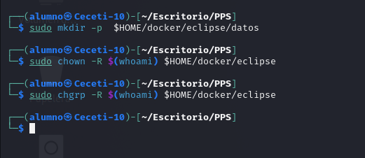

2. Configurar el entorno gráfico:
   
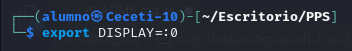
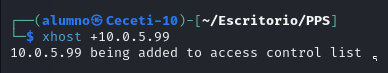

3. Lanzar el contenedor:

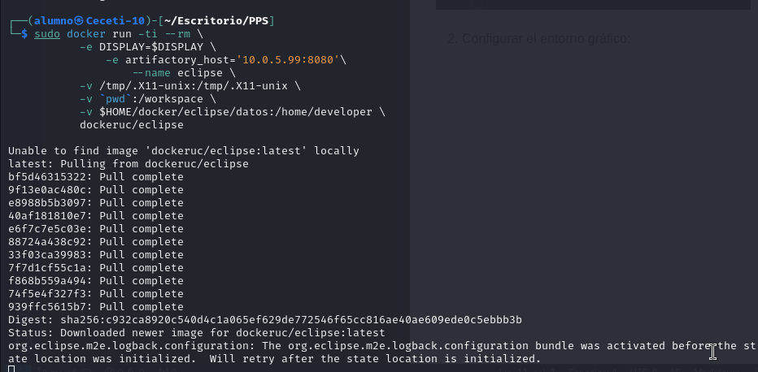

Este comando ejecuta un contenedor Docker llamado eclipse con soporte gráfico para ejecutar Eclipse. Usa la imagen dockeruc/eclipse y monta volúmenes para habilitar la interacción con tu entorno local: el socket X11 (/tmp/.X11-unix) para mostrar interfaces gráficas, la carpeta actual como /workspace dentro del contenedor, y $HOME/docker/eclipse/datos como /home/developer para persistir datos. También pasa variables de entorno como DISPLAY para el servidor gráfico y artifactory_host con la IP y puerto de un servidor Artifactory. El contenedor se ejecuta en modo interactivo y se elimina automáticamente al cerrarse.

### Instalar extensiones

Las mejores extensiones de Visual Studio Code son: 

1. Prettier: Formateador automático de código para mantener estilos consistentes.
2. ESLint: Identifica y corrige problemas de JavaScript y TypeScript.
3. GitLens: Mejora el uso de Git con historial detallado y anotaciones en el código.
4. Live Server: Levanta un servidor local con recarga en vivo para desarrollo frontend.
5. Bracket Pair Colorizer 2: Colorea paréntesis coincidentes para mejor legibilidad(esta ya en desuso porque ya lo viene integrado en visual code).
6. Path Intellisense: Autocompleta rutas de archivos mientras escribes.
7. IntelliCode: Ofrece recomendaciones de autocompletado impulsadas por IA.

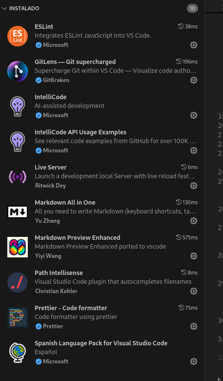

Qué hace Checkstyle:

- Valida reglas de estilo: Verifica que tu código Java cumpla con un estándar predefinido (por ejemplo, convenciones como Google Java Style o tus propias reglas personalizadas).
- Detecta problemas comunes: Señala problemas como nombres incorrectos de variables/clases, formato de código, líneas largas, etc.
- Se integra con builds: Muy utilizado en herramientas como Maven o Gradle para asegurar que el código cumpla con las reglas de estilo en todo momento.

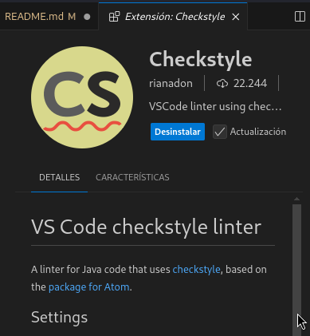

Qué hace SonarQube:

- Detecta problemas de calidad de código: Encuentra bugs, vulnerabilidades de seguridad y problemas de mantenimiento.
- Proporciona sugerencias: Ofrece explicaciones detalladas sobre los problemas encontrados y cómo solucionarlos.
- Se integra con SonarQube/SonarCloud: Si usas estas herramientas en tu equipo, SonarLint puede sincronizar reglas y métricas.

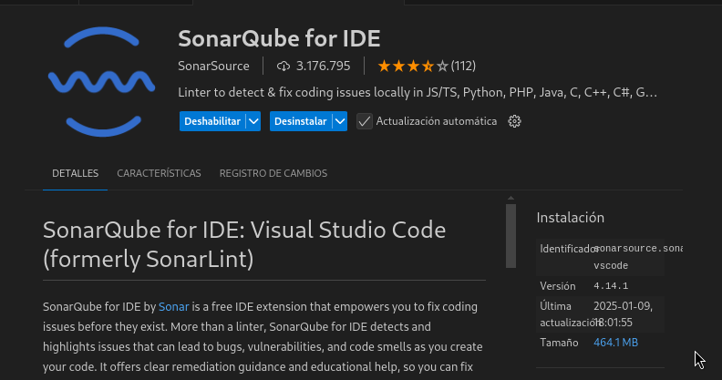

### Prueba entornos

Tenemos este programa python:

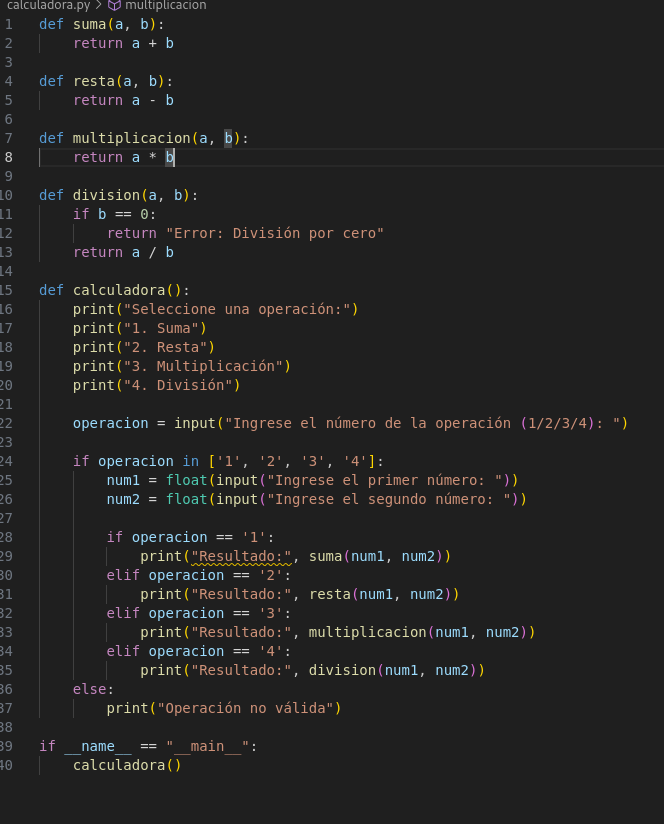

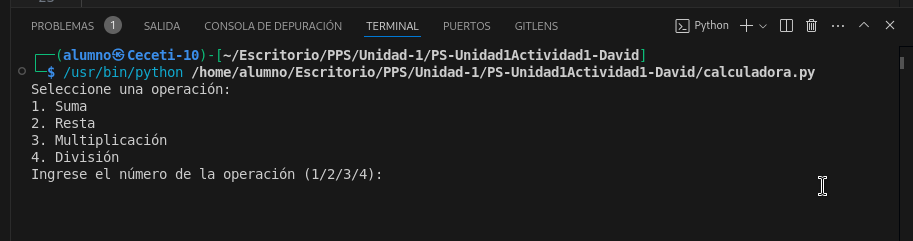

Para depurar python tenemos la extension oficial de Microsoft Python.

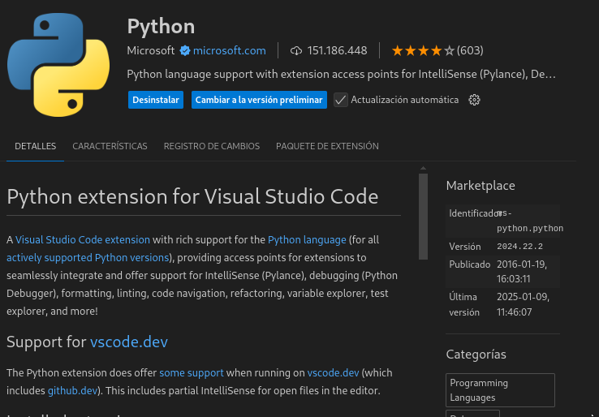

Vemos por ejemplo que ,con la extensión habilitada, directamente nos puede salir los errores en pantalla como este: 

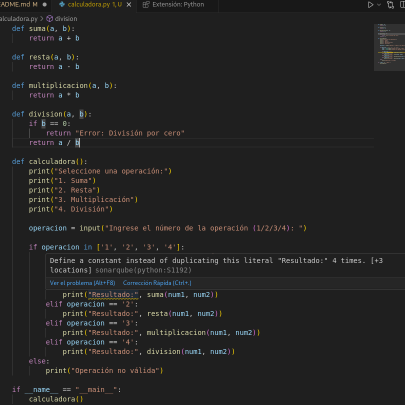

Es muy buena ya que te explica el error de manera muy intuitiva.